# llmctl


<p align="center">
  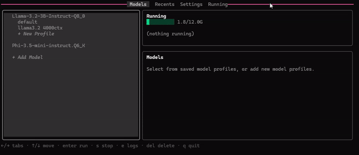
</p>

`llmctl` is a terminal UI and small CLI for managing local `llama-server`
instances. It keeps a config of models and reusable launch profiles, lets you
import GGUF files from model directories, starts profiles as detached processes,
tracks running instances, and gives you quick access to output logs.

## Why llmctl?

Running `llama-server` by hand means reconstructing a long command line every
time — port, context size, GPU layers, sampling parameters, cache settings, and
whatever else the model needs. There is no record of what flags you used last
time, no easy way to switch between a "fast draft" and a "high quality" setup
for the same model, and nothing to tell you what is currently running or why it
crashed.

`llmctl` solves this by storing named profiles alongside each model. A profile
captures every `llama-server` flag you care about. From there you can run,
inspect, or stop any instance from a single TUI without touching the command
line again. Logs are collected automatically, health and token rate are polled
live, and the config file is plain YAML so it is easy to version or share.

## Overview

The main app is organized around tabs:

- **Models**: browse imported models, create/edit profiles, and run them.
- **Recents**: quickly rerun recently used model profiles.
- **Settings**: configure directories, llama-server binary, and RPC settings.
- **Running**: inspect running servers, preview output, view logs, or stop them.
- **Network** *(Linux only — requires RPC enabled and Network Tab enabled in Settings)*: manage network connections for RPC offload.

## Requirements

- `llama-server` from llama.cpp.
- GGUF model files, or a model/profile configured for Hugging Face loading.
- On Windows, `llama-server.exe` must be on `PATH`, or `llama_server_bin` must
  point to the full executable path in `config.yaml`.

## Install

Download the latest release for your platform from the repository releases,
then place the `llmctl` executable somewhere on your `PATH`.

Run the TUI:

```sh
llmctl
```

Use a specific config file when needed:

```sh
llmctl --config path/to/config.yaml
```

## First Launch

<p align="center">
  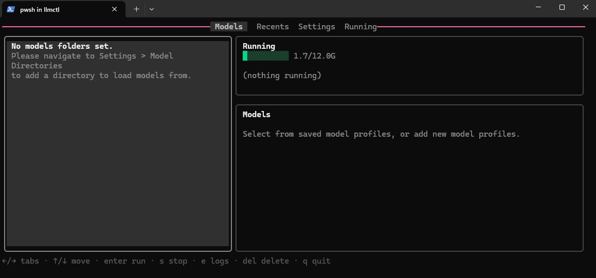
</p>

On first launch, `llmctl` creates or loads its config. By default it looks for:

1. `./config/config.yaml`
2. `~/.llmctl/config.yaml`

### Quick Reference

| Key | Action |
| :--- | :--- |
| `Arrows` / `Enter` | Navigate and select |
| `s` | Stop running instance |
| `e` | View logs |
| `c` | Copy OpenAI-compatible endpoint |
| `/` | Search/filter models |
| `del` | Delete (where supported) |
| `q` | Quit |

## Configure Model Directories

<p align="center">
  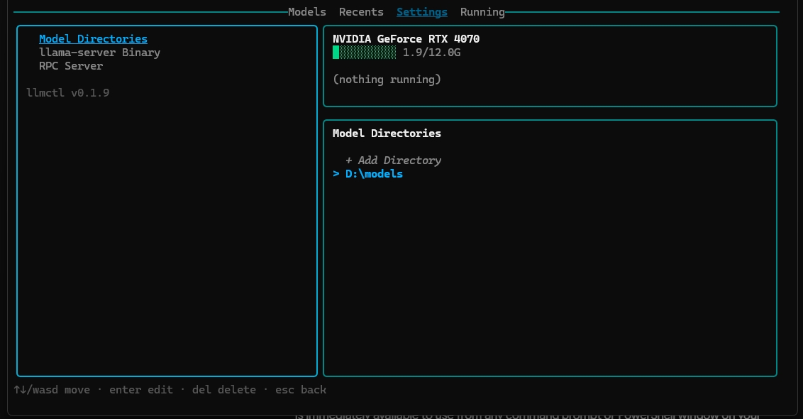
</p>

Go to **Settings**, select **Model Directories**, and add one or more folders
that contain `.gguf` files. These folders are scanned when adding models.

The config field behind this is:

```yaml
models_dirs:
  - C:\path\to\models
```

## Configure llama-server Executable

Go to **Settings**, select **llama-server Executable**, and enter the full path
to `llama-server` (or `llama-server.exe` on Windows). This is useful when the
binary is not on your `PATH` — common on Windows where the build output lands
in a deep `Release` subdirectory.

The config field behind this is (depends on your install location):

```yaml
llama_server_bin: C:\llama.cpp\build\bin\Release\llama-server.exe
```

Leave it blank (or omit it) to fall back to searching `PATH`.

## Add A Model

<p align="center">
  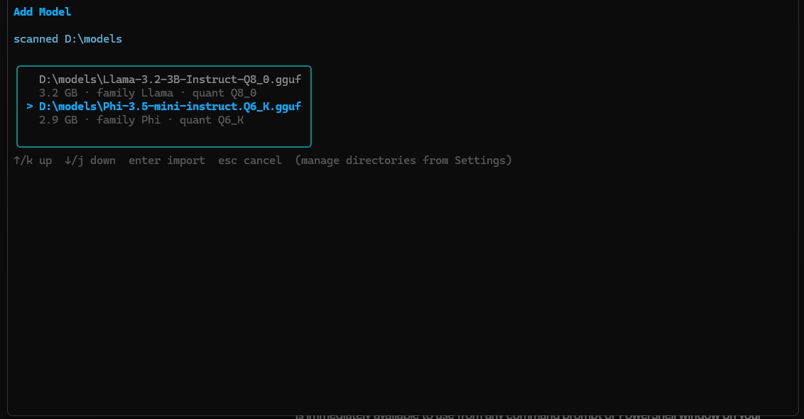
</p>

In **Models**, select **+ Add Model**. The picker scans your configured model
directories and lists GGUF files that are not already configured.

Importing a model creates a default profile so it can be run immediately.

## Browse Models

<p align="center">
  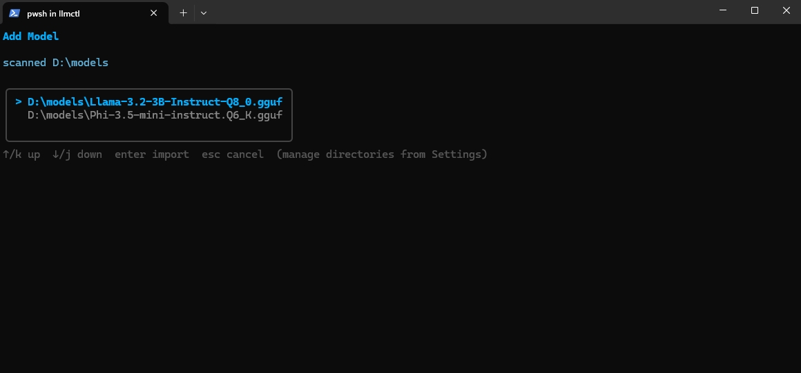
</p>

Move through the Models list with the arrow keys. A focused model expands to
show the profiles it has, but you remain in model navigation until you press
`enter` or right arrow on the model.

Press `/` to open a search filter. Type any part of a model name to narrow the
list, press `enter` to confirm and keep the filter active, or `esc` to clear it.

## Select A Saved Profile

<p align="center">
  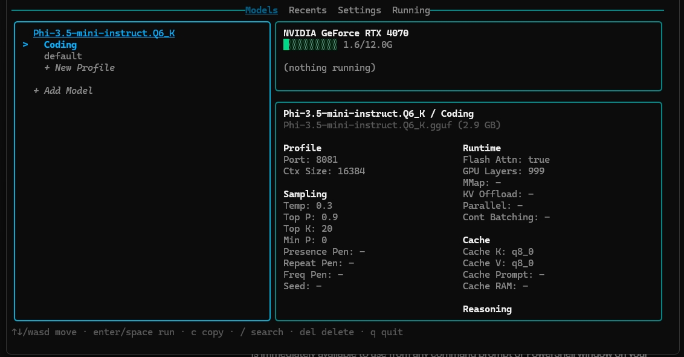
</p>

After entering a model, navigate its saved profiles or choose **+ New Profile**.
The active model is underlined while you are navigating its profiles.

## Create A New Profile

<p align="center">
  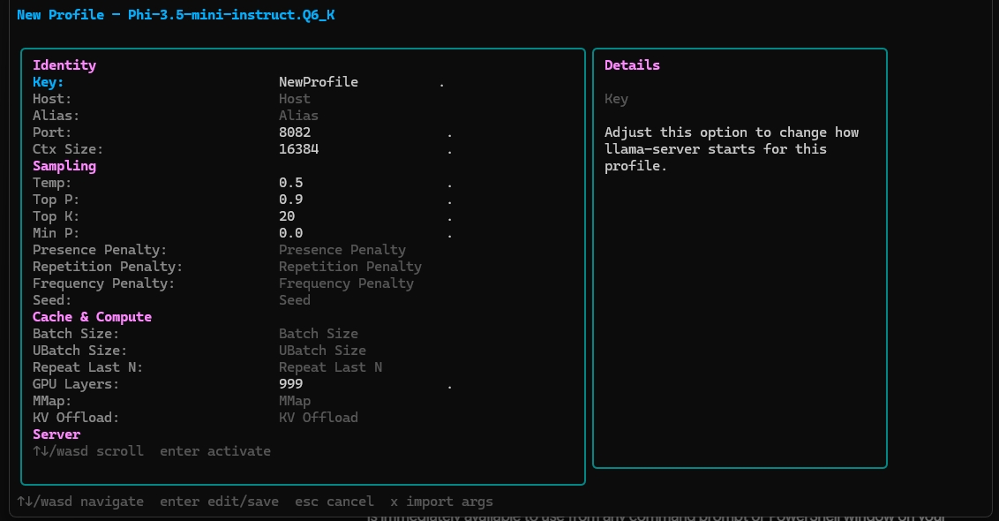
</p>

Profiles store reusable `llama-server` settings such as port, context size,
sampling parameters, GPU layers, cache settings, extra args, and notes.

When editing a profile:

- Use arrow keys to move between fields.
- Type to edit text fields.
- Toggle boolean fields where available.
- Press `enter` to save.
- Press `esc` to exit. If you changed anything, `llmctl` asks whether to save or
  exit without saving.

## Export A Profile

A profile's full `llama-server` command can be exported as a shell script or
copied directly. Select a profile, choose **Export**, and pick your format.

<p align="center">
  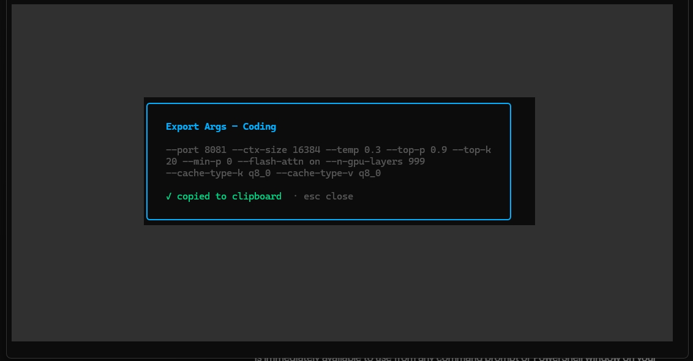
</p>

## Run A Profile

<p align="center">
  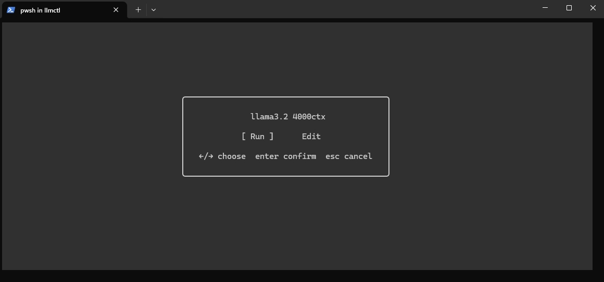
</p>

Choose **Run** to start the profile as a detached `llama-server` process. The
server output is written to a log file under `~/.llmctl/logs`.

You can also run a profile directly from the command line:

```sh
llmctl run <model> <profile>
```

## Running Models

<p align="center">
  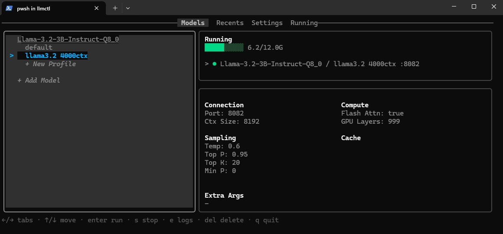
</p>

The main screen shows currently running profiles, their ports, health, token
rate when active, and GPU memory when `nvidia-smi` is available.

A colored dot indicates the current state:

- **Yellow ●** — `loading`: the process started but the server is still
  initialising and not yet accepting requests.
- **Green ●** — `up`: the server passed its health check and is ready.
- **Red ●** — `down`: the server is not responding.

<p align="center">
  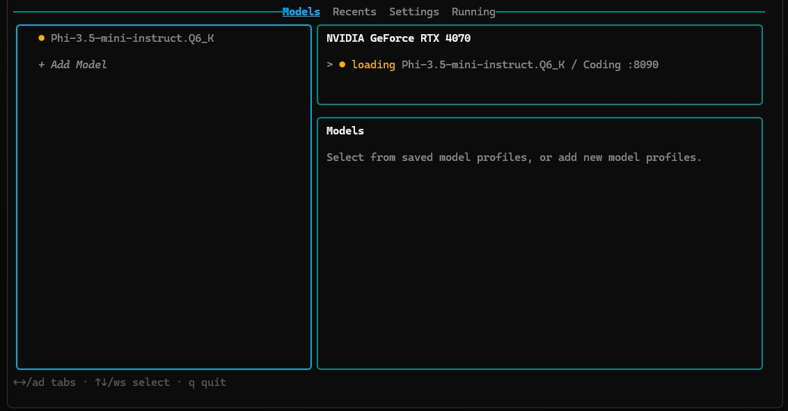
</p>

List running profiles from the command line:

```sh
llmctl ps
```

## Running Page

<p align="center">
  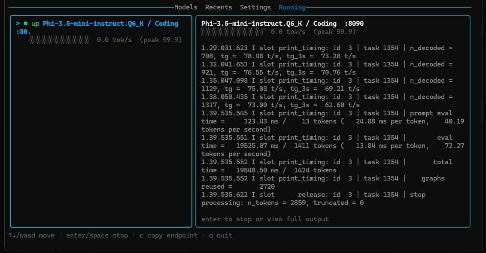
</p>

Go to **Running** to select active instances. The right pane previews recent
output from the selected server.

## View Output Or Stop

<p align="center">
  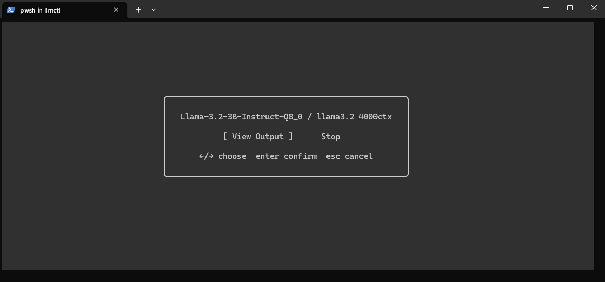
</p>

Press `enter` on a running profile to choose whether to view full output or stop
the process.

Select **Copy Endpoint** from the same modal, or press `c` while a running
profile is highlighted, to copy its OpenAI-compatible base URL
(`http://localhost:<port>/v1`) to the clipboard.

You can also stop from the CLI:

```sh
llmctl stop <model> <profile>
```

## Logs

<p align="center">
  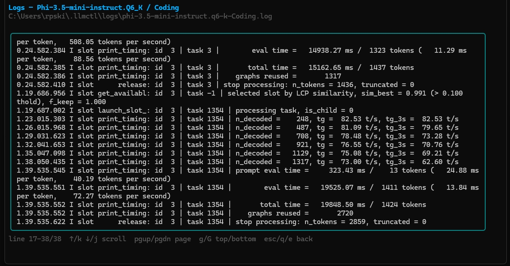
</p>

Press `e` in the TUI to open logs for the selected profile or running instance.

From the CLI:

```sh
llmctl logs <model> <profile>
llmctl logs -f <model> <profile>
```

<details>
<summary><b>Configuration File Format</b></summary>
<br>

## Configuration

You'll never need to manually edit the config since it's maintained by llmctl, but if you're curious, here is how it's formatted:

```yaml
llama_server_bin: llama-server
models_dirs:
  - D:\models
models:
  my-model:
    name: My Model
    path: D:\models\my-model.gguf
    profiles:
      default:
        port: 8080
        ctx_size: 8192
        gpu_layers: 99
        flash_attention: true
        notes: General purpose local profile.
```

On Windows, if `llama-server` is not on `PATH`, set:

```yaml
llama_server_bin: D:\path\to\llama-server.exe
```

</details>

<details>
<summary><b>RPC Offload (Linux → Windows GPU)</b></summary>
<br>

## RPC Offload (Linux → Windows GPU)

llmctl supports llama.cpp's RPC backend, which lets a Linux machine offload
model layers to a GPU on a Windows machine over a direct ethernet or LAN
connection.

### Windows setup

Start the RPC server on the Windows machine, binding to all interfaces:

```powershell
ggml-rpc-server.exe -H 0.0.0.0 -p 50052
```

Open port 50052 in Windows Firewall (run PowerShell as Administrator):

```powershell
netsh advfirewall firewall add rule name="GGML RPC Server" dir=in action=allow protocol=TCP localport=50052
```

If the Windows ethernet adapter is classified as a Public network, change it
to Private so firewall rules apply correctly:

```powershell
Set-NetConnectionProfile -InterfaceAlias "Ethernet" -NetworkCategory Private
```

### Linux setup

In **Settings → RPC Server**, toggle RPC on and set the endpoint to the Windows
machine's IP and port (e.g. `192.168.50.1:50052`).

<p align="center">
  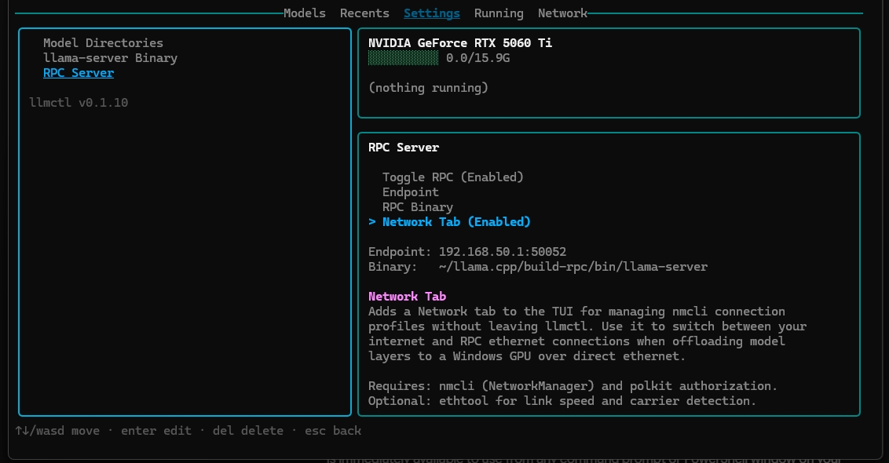
</p>

If connecting over a direct ethernet cable (not through a router), set a
static IP on the Linux side to match the Windows machine's subnet:

```bash
nmcli connection modify "Wired connection 1" \
  ipv4.method manual \
  ipv4.addresses "192.168.50.2/24" \
  ipv4.gateway ""
nmcli connection up "Wired connection 1"
```

### Optional: jumbo frames (MTU 9000) for direct ethernet

If you are using a direct ethernet cable between the two machines, raising the
MTU from 1500 to 9000 bytes reduces per-packet overhead when transferring large
tensors and can meaningfully improve throughput. Both ends must be set to the
same value.

**Windows** — first enable "Jumbo Packet" support in the NIC driver:

1. Open **Device Manager**, expand **Network adapters**, right-click the direct
   ethernet adapter → **Properties**.
2. On the **Advanced** tab, find **Jumbo Packet** (or **Jumbo Frame**) and set
   it to **9014 Bytes** (or the closest available value ≥ 9000).
3. Then apply the MTU in PowerShell (as Administrator):

```powershell
netsh interface ipv4 set subinterface "Ethernet" mtu=9000 store=persistent
```

Replace `"Ethernet"` with the actual adapter name shown by `netsh interface show interface`.

**Linux** — apply and persist via NetworkManager:

```bash
# Apply immediately
sudo ip link set enp8s0 mtu 9000

# Persist across reboots (replace "Wired connection 1" with your connection name)
nmcli connection modify "Wired connection 1" 802-3-ethernet.mtu 9000
nmcli connection up "Wired connection 1"
```

Verify both ends can pass large frames:

```bash
# From Linux — should receive replies with 0% loss
ping -M do -s 8972 192.168.50.1
```

`8972` + 28 bytes of IP/ICMP headers = 9000. If the ping times out, one end
does not support jumbo frames or the driver setting was not applied.

### Network tab (Linux only)

The Network tab lets you switch between your internet and RPC ethernet
connections and monitor link state without leaving llmctl. It is separate from
RPC being enabled — you opt into it explicitly.

**To enable:** go to **Settings → RPC Server**, navigate to **Network Tab**, and
press `enter` to toggle it on. llmctl checks that `nmcli` is available before
enabling; if it is not found, an error is shown with instructions.

<p align="center">
  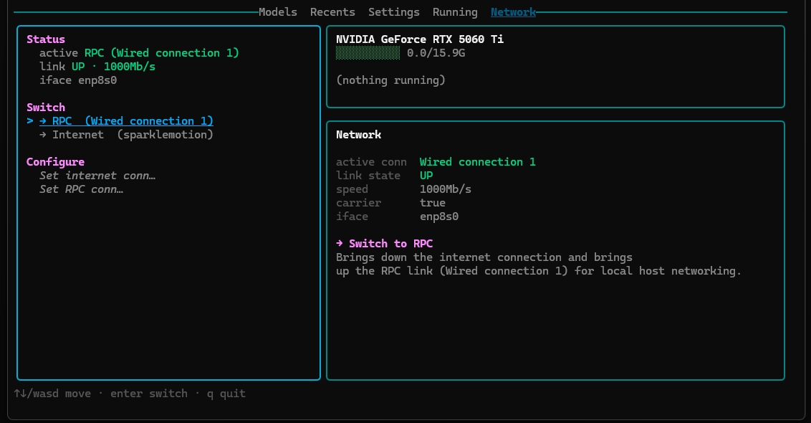
</p>

Navigate to **Network → Configure** to assign which nmcli connection profile
is your internet connection and which is your RPC link. These assignments are
saved to `config.yaml` and restored on next launch.

<p align="center">
  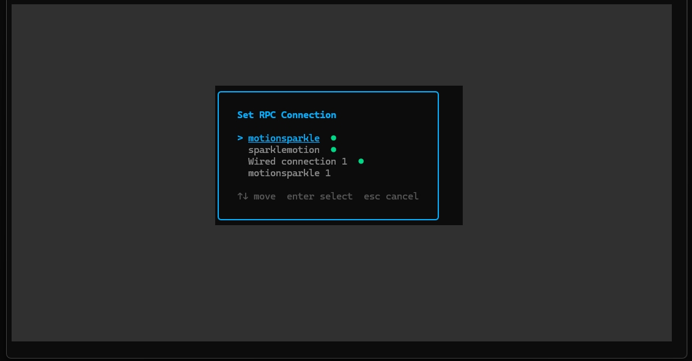
</p>

The switch brings up the target connection and lets NetworkManager handle
any conflict on the same interface automatically — no manual `down` required.

#### Granting network control without a password

nmcli requires polkit authorization to bring connections up and down. On
Ubuntu, create a local authority file to grant the `netdev` group permission:

```bash
sudo mkdir -p /etc/polkit-1/localauthority/50-local.d/
sudo tee /etc/polkit-1/localauthority/50-local.d/10-llmctl-network.pkla <<'EOF'
[NetworkManager netdev group]
Identity=unix-group:netdev
Action=org.freedesktop.NetworkManager.*
ResultAny=yes
ResultInactive=yes
ResultActive=yes
EOF
```

Then add your user to the `netdev` group and log out and back in:

```bash
sudo usermod -aG netdev $USER
```

If the TUI shows "Not authorized to control networking", the Network tab's
Details pane displays the fix command and lets you copy it with `c`.

#### Multi-interface setups (ethernet + wifi)

If your internet and RPC connections use different physical interfaces (e.g.
wifi for internet, ethernet for RPC), both can be active simultaneously —
NetworkManager routes RPC traffic over ethernet automatically via the
`192.168.50.0/24` subnet route. No switching is needed in this case; just
bring up the RPC ethernet connection once and leave both active.

</details>

<details>
<summary><b>Troubleshooting</b></summary>
<br>

## Troubleshooting

### `llama-server` not found

If you see:

```text
start llama-server: llama-server binary "llama-server" not found
```

Install/build llama.cpp and either add the directory containing
`llama-server.exe` to `PATH`, or set `llama_server_bin` to the full executable
path in `config.yaml`.

### Model directory is empty

Add a folder under **Settings > Model Directories** that contains `.gguf` files,
then return to **Models > + Add Model**.

### Profile starts and exits immediately

Open logs with `e` in the TUI or:

```sh
llmctl logs <model> <profile>
```

The most common causes are an invalid `llama-server` flag, a missing model file,
or a port already in use.

### Network Tab toggle is greyed out or shows an error

The Network Tab requires `nmcli` (NetworkManager). Install it with your
package manager:

```bash
# Ubuntu / Debian
sudo apt install network-manager

# Arch
sudo pacman -S networkmanager
```

Then re-attempt the toggle in **Settings → RPC Server**.

</details>
