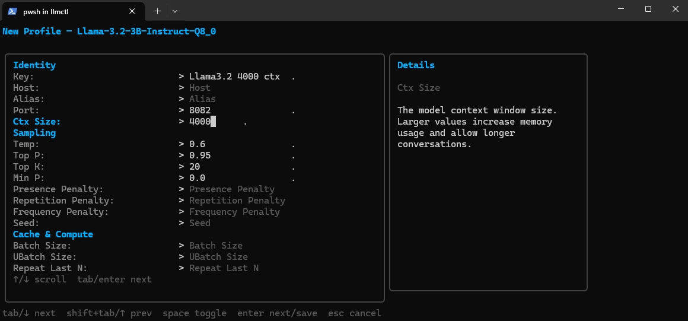

# llmctl


<p align="center">
  
</p>

`llmctl` is a terminal UI and small CLI for managing local `llama-server`
instances. It keeps a config of models and reusable launch profiles, lets you
import GGUF files from model directories, starts profiles as detached processes,
tracks running instances, and gives you quick access to output logs.

## Why llmctl?

Running `llama-server` by hand means reconstructing a long command line every
time — port, context size, GPU layers, sampling parameters, cache settings, and
whatever else the model needs. There is no record of what flags you used last
time, no easy way to switch between a "fast draft" and a "high quality" setup
for the same model, and nothing to tell you what is currently running or why it
crashed.

`llmctl` solves this by storing named profiles alongside each model. A profile
captures every `llama-server` flag you care about. From there you can run,
inspect, or stop any instance from a single TUI without touching the command
line again. Logs are collected automatically, health and token rate are polled
live, and the config file is plain YAML so it is easy to version or share.

## Overview

The main app is organized around four tabs:

- **Models**: browse imported models, create/edit profiles, and run them.
- **Recents**: quickly rerun recently used model profiles.
- **Settings**: configure directories that are scanned for GGUF model files.
- **Running**: inspect running servers, preview output, view logs, or stop them.

## Requirements

- `llama-server` from llama.cpp.
- GGUF model files, or a model/profile configured for Hugging Face loading.
- On Windows, `llama-server.exe` must be on `PATH`, or `llama_server_bin` must
  point to the full executable path in `config.yaml`.

## Install

Download the latest release for your platform from the repository releases,
then place the `llmctl` executable somewhere on your `PATH`.

Run the TUI:

```sh
llmctl
```

Use a specific config file when needed:

```sh
llmctl --config path/to/config.yaml
```

## First Launch

<p align="center">
  
</p>

On first launch, `llmctl` creates or loads its config. By default it looks for:

1. `./config/config.yaml`
2. `~/.llmctl/config.yaml`

The footer shows the available hotkeys for the current screen. In the main TUI,
use arrow keys to move, `enter` to select or run, `s` to stop, `e` to view logs,
`del` to delete where supported, and `q` to quit.

## Configure Model Directories

<p align="center">
  
</p>

Go to **Settings**, select **Model Directories**, and add one or more folders
that contain `.gguf` files. These folders are scanned when adding models.

The config field behind this is:

```yaml
models_dirs:
  - C:\path\to\models
```

## Configure llama-server Executable

Go to **Settings**, select **llama-server Executable**, and enter the full path
to `llama-server` (or `llama-server.exe` on Windows). This is useful when the
binary is not on your `PATH` — common on Windows where the build output lands
in a deep `Release` subdirectory.

The config field behind this is:
(depends on your install location)
```yaml
llama_server_bin: C:\llama.cpp\build\bin\Release\llama-server.exe
```

Leave it blank (or omit it) to fall back to searching `PATH`.

## Add A Model

<p align="center">
  
</p>

In **Models**, select **+ Add Model**. The picker scans your configured model
directories and lists GGUF files that are not already configured.

Importing a model creates a default profile so it can be run immediately.

## Browse Models

<p align="center">
  
</p>

Move through the Models list with the arrow keys. A focused model expands to
show the profiles it has, but you remain in model navigation until you press
`enter` or right arrow on the model.

Press `/` to open a search filter. Type any part of a model name to narrow the
list, press `enter` to confirm and keep the filter active, or `esc` to clear it.

## Select A Saved Profile

<p align="center">
  
</p>

After entering a model, navigate its saved profiles or choose **+ New Profile**.
The active model is underlined while you are navigating its profiles.

## Create A New Profile

<p align="center">
  
</p>

Profiles store reusable `llama-server` settings such as port, context size,
sampling parameters, GPU layers, cache settings, extra args, and notes.

When editing a profile:

- Use arrow keys to move between fields.
- Type to edit text fields.
- Toggle boolean fields where available.
- Press `enter` to save.
- Press `esc` to exit. If you changed anything, `llmctl` asks whether to save or
  exit without saving.

## Edit A Profile

<p align="center">
  
</p>

Selecting an existing profile opens a Run/Edit choice. Choose **Edit** to update
the saved profile. Long descriptions and parameter help stay inside fixed panes
so the TUI does not grow beyond the terminal viewport.

## Run A Profile

<p align="center">
  
</p>

Choose **Run** to start the profile as a detached `llama-server` process. The
server output is written to a log file under `~/.llmctl/logs`.

You can also run a profile directly from the command line:

```sh
llmctl run <model> <profile>
```

## Running Models

<p align="center">
  
</p>

The main screen shows currently running profiles, their ports, health, token
rate when active, and GPU memory when `nvidia-smi` is available.

List running profiles from the command line:

```sh
llmctl ps
```

## Running Page

<p align="center">
  
</p>

Go to **Running** to select active instances. The right pane previews recent
output from the selected server.

## View Output Or Stop

<p align="center">
  
</p>

Press `enter` on a running profile to choose whether to view full output or stop
the process.

Select **Copy Endpoint** from the same modal, or press `c` while a running
profile is highlighted, to copy its OpenAI-compatible base URL
(`http://localhost:<port>/v1`) to the clipboard.

You can also stop from the CLI:

```sh
llmctl stop <model> <profile>
```

## Logs

<p align="center">
  
</p>

Press `e` in the TUI to open logs for the selected profile or running instance.

From the CLI:

```sh
llmctl logs <model> <profile>
llmctl logs -f <model> <profile>
```

## Configuration

You'll never need to manually edit the config, its maintained by llmctl, however if youre curious this is how its formatted.
Example config:

```yaml
llama_server_bin: llama-server
models_dirs:
  - D:\models
models:
  my-model:
    name: My Model
    path: D:\models\my-model.gguf
    profiles:
      default:
        port: 8080
        ctx_size: 8192
        gpu_layers: 99
        flash_attention: true
        notes: General purpose local profile.
```

On Windows, if `llama-server` is not on `PATH`, set:

```yaml
llama_server_bin: D:\path\to\llama-server.exe
```

## Troubleshooting

### `llama-server` not found

If you see:

```text
start llama-server: llama-server binary "llama-server" not found
```

Install/build llama.cpp and either add the directory containing
`llama-server.exe` to `PATH`, or set `llama_server_bin` to the full executable
path in `config.yaml`.

### Model directory is empty

Add a folder under **Settings > Model Directories** that contains `.gguf` files,
then return to **Models > + Add Model**.

### Profile starts and exits immediately

Open logs with `e` in the TUI or:

```sh
llmctl logs <model> <profile>
```

The most common causes are an invalid `llama-server` flag, a missing model file,
or a port already in use.
