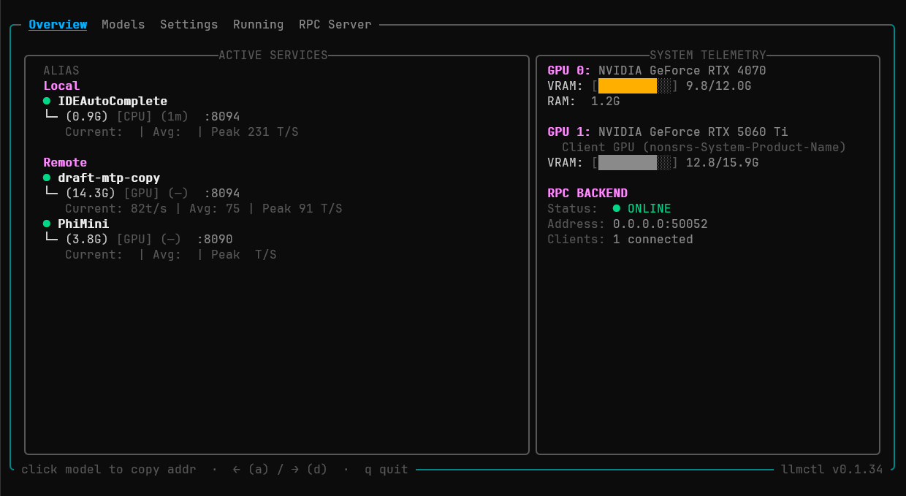

# Concepts

This page explains the mental model behind llmctl — the terms used throughout the interface and docs, and how the pieces fit together.

---

## Models

A **model** in llmctl represents a GGUF file on disk (or a remote endpoint). It's the thing you want to run inference on.

When you add a model directory in Settings, llmctl finds every `.gguf` file there and makes them available to import. Importing registers the file with llmctl and gives it a name — from that point it appears in the Add Models tab tree. Once a model has been added, it appearts in the model list for configuring profiles.

A model on its own doesn't do anything. To actually run it, you need a profile.

---

## Profiles

A **profile** is a named configuration for a model. It defines *how* that model runs: which port it listens on, how many layers go on the GPU, how much context it gets, and what sampling parameters it uses.

One model can have many profiles. For example, a single Phi-4 GGUF might have:

- `LowMemory` — 20 GPU layers, 2048 context, port 8080 (fits in 4GB VRAM)
- `FullGPU` — 99 GPU layers, 8192 context, port 8081 (needs 12GB VRAM)
- `IDEAutoComplete` — CPU-only, 1024 context, port 8082 (dedicated to editor integration)

You create and edit profiles entirely within the TUI — no config file editing required.


---

## Running Instances

Starting a profile launches a **running instance** — a live `llama-server` process managed by llmctl. The instance has:

- A health status: **loading** (yellow), **up** (green), or **down** (red)
- A port it's listening on for OpenAI-compatible API requests
- Real-time metrics: tok/s, VRAM or RAM usage, uptime

Multiple instances can run simultaneously as long as they're on different ports.

The **Running** tab lists all active instances. The **Overview** tab shows them in a more visual summary alongside system telemetry.


---

## The Overview Tab

The Overview tab is the main at-a-glance dashboard. It's split into two boxes:

**Active Services** — lists every running instance on this machine under *Local*, and any running instances on connected RPC client machines under *Remote*. Each entry shows the model alias, size, whether it's using GPU or CPU, uptime, port, and live tok/s statistics.

**System Telemetry** — shows GPU name and VRAM usage for your local GPU (GPU 0) and any remote GPU connected via RPC (GPU 1), plus RPC backend status.



---

## RPC Mode

llmctl supports [llama.cpp's RPC backend](https://github.com/ggerganov/llama.cpp/tree/master/examples/rpc), which lets you distribute a model's layers across GPUs on separate machines.

One machine runs in **server mode** — it starts a `ggml-rpc-server` process that exposes its GPU over the network. The other machine runs in **client mode** — when it starts a model, some layers are offloaded to the RPC server's GPU rather than its own.

This is useful when:
- You have two machines with smaller GPUs and want to run a larger model than either could hold alone
- You want to maximize VRAM headroom by pushing layers to a secondary GPU

llmctl handles the connection automatically once you give the client machine the server's address. See the [RPC guide](./guides/rpc) for setup steps.

---

## The Status Server

Every llmctl instance can run a lightweight HTTP server that exposes its current state as JSON — what models are running, VRAM usage, tok/s, health. This is called the **status server**.

The primary use is the RPC server/client pairing: when a client polls the server's status address, it discovers the RPC endpoint automatically and can display the server's GPU telemetry in its own Overview tab.

You can also poll the status endpoint from external scripts or monitoring tools:

```bash
curl http://192.168.1.10:11435/status
```

---

## Profiles vs. Instances

This is a common source of confusion:

| | Profile | Instance |
|---|---|---|
| What it is | A saved configuration | A running process |
| Lives in | The TUI (and config file) | Memory, until stopped |
| Can have many? | Yes, per model | Yes, as long as ports differ |
| Persists across restarts? | Yes | No — must be started again (However running models stay running even when you exit llmctl) |

Think of a profile like a saved launch configuration. Starting it creates an instance. Stopping the instance doesn't delete the profile.
