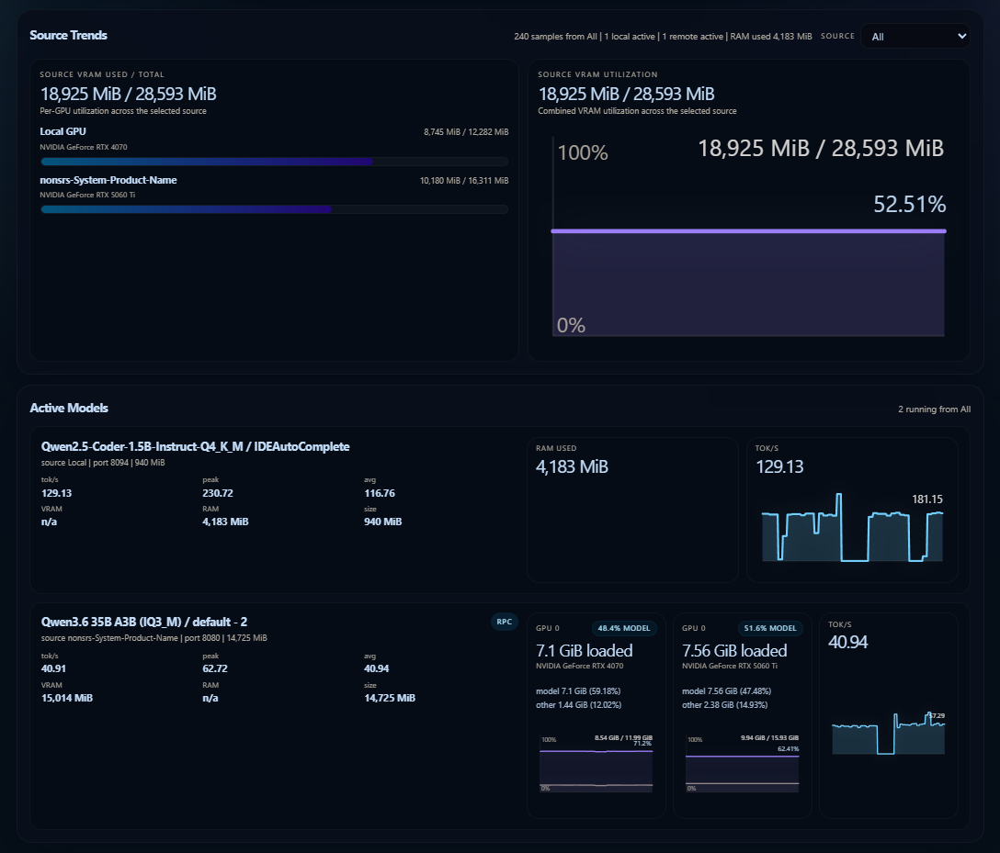

# Status Server

The status server is llmctl's lightweight JSON and browser monitoring surface.
It is independent from RPC, so you can run the dashboard and history store without
enabling distributed GPU mode.

## What it exposes

- `GET /status` for the current snapshot
- `GET /history` for recent snapshots
- `GET /dashboard` for the browser dashboard when enabled
- `GET /` redirects to `/dashboard` when the dashboard is enabled, otherwise to `/status`

`/status` is the live source of truth. `/history` powers the dashboard charts.



## Settings

- Status server enable/disable
- Host and port
- History persistence
- Dashboard serving

History persistence stores samples in `~/.llmctl/status_history.json` and restores
them on restart when enabled.

## Example

```bash
curl http://127.0.0.1:11435/status
```

Use the host and port shown in llmctl settings.
