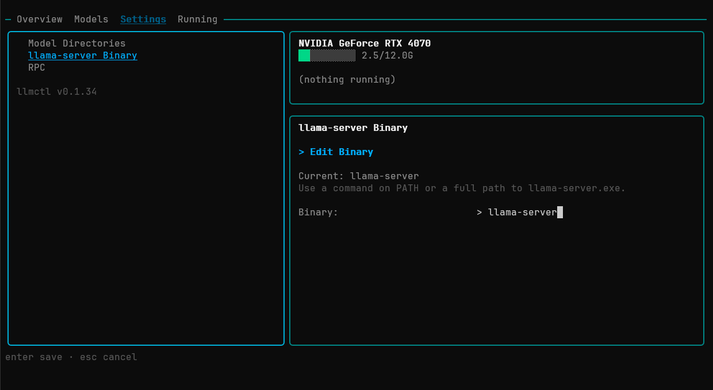
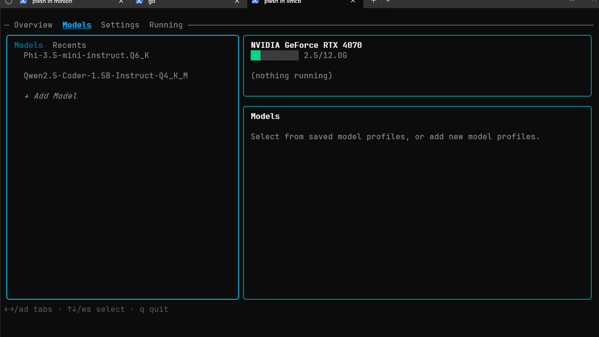
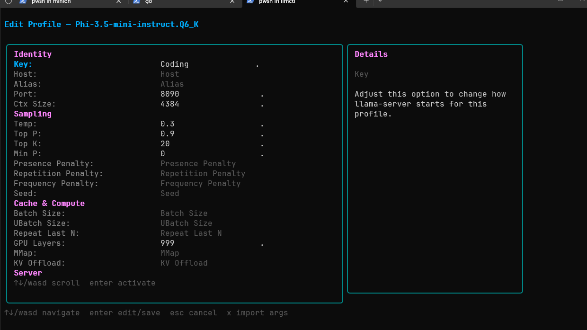
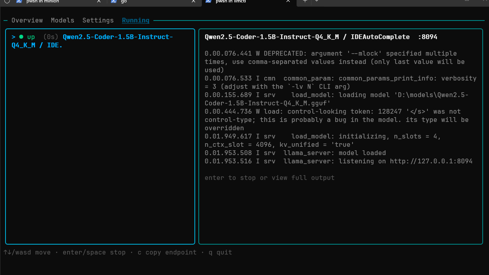
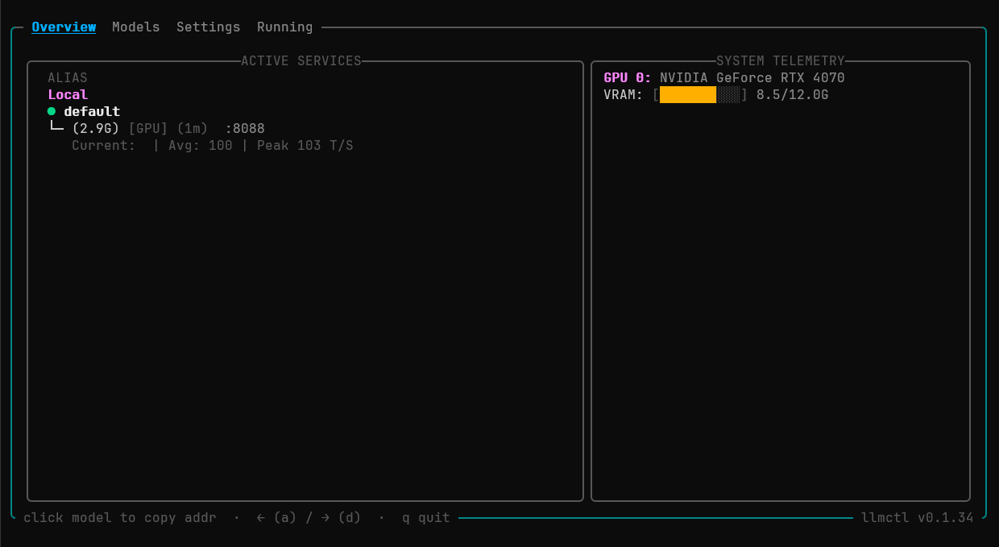

# Quickstart

Get a model running and responding to requests in under five minutes. No config file editing — everything happens in the TUI.

**Before you start:** make sure you have `llama-server` installed and at least one `.gguf` file on disk. See [Installation](./installation) if you haven't done that yet.

---

## 1. Launch llmctl

```bash
llmctl
```

You'll land on the **Overview** tab with empty Active Services.

---

## 2. Set your llama-server path

Press `d` twice from Overview to reach the **Settings** tab.



Under **llama-server binary**, enter the full path to your `llama-server` executable — for example `/usr/local/bin/llama-server` on Linux or `C:\llama\llama-server.exe` on Windows.

Under **Model directories**, add the folder(s) where your GGUF files live. llmctl scans these directories and makes every `.gguf` it finds available to import.

Press `a` once to go back to the **Models** tab when done.

---

## 3. Import a model

Press `d` once to reach the **Models** tab.

If your model directory is set, select `+ Add Model` and press `Enter` to scan your directories and add any GGUFs found.



Your model appears in the left pane. Model Profiles live nested under their parent model. Press `Enter` or `→` to expand a parent model to navigate them.

---

## 4. Create a profile

With the model expanded, select `+ New Profile` to create a new profile.

A form opens. The only field you must fill in is **Port** — this is the port `llama-server` will listen on. Everything else has sensible defaults.



A minimal starting profile:

| Field | Value | Notes |
|---|---|---|
| Port | `8080` | Any free port |
| GPU Layers | `99` | Loads entire model onto GPU; lower this if you run out of VRAM |
| Context Size | `4096` | How many tokens the model can hold at once |

Press `Enter` to save. The profile appears under the model in the tree.

---

## 5. Start the model

Navigate to the profile row (arrow keys) and press `Enter` to start it.

The health indicator next to the model name starts as a yellow loading dot. Once `llama-server` finishes loading the weights, it turns green.



Load time depends on model size and whether you're using GPU or CPU. A 4GB model on a modern GPU typically loads in under 10 seconds.

---

## 6. Confirm it's live

Press `a` to go back to the **Overview** tab. You should see your model listed under **Local** in the Active Services box with a green dot and its port.



---

## 7. Send a request

Open a separate terminal and send a test completion, like you would normally interface with a llama cpp server:

```bash
curl http://localhost:8080/v1/chat/completions \
  -H "Content-Type: application/json" \
  -d '{
    "model": "local",
    "messages": [{"role": "user", "content": "Hello, are you working?"}]
  }'
```

You'll see the tok/s counter update in the Overview tab while the response generates.

---

## What's next

- **Multiple profiles** — create a second profile on a different port with different GPU layers or context size: [Profiles guide](./guides/profiles)
- **CPU-only mode** — run a model entirely on RAM with no GPU: [Profiles guide](./guides/profiles#cpu-only-mode)
- **Distribute across two machines** — offload layers to another GPU over the network: [RPC guide](./guides/rpc)
- **Understand what you're looking at** — read [Concepts](./concepts) for a full explanation of models, profiles, and instances
