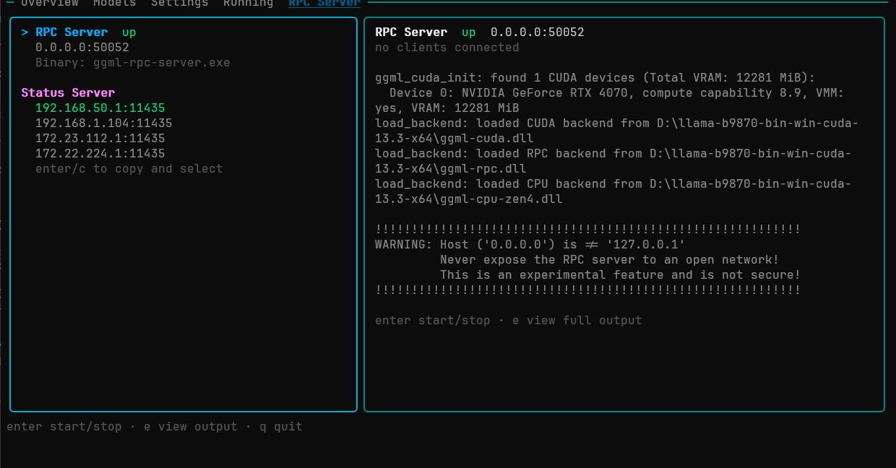
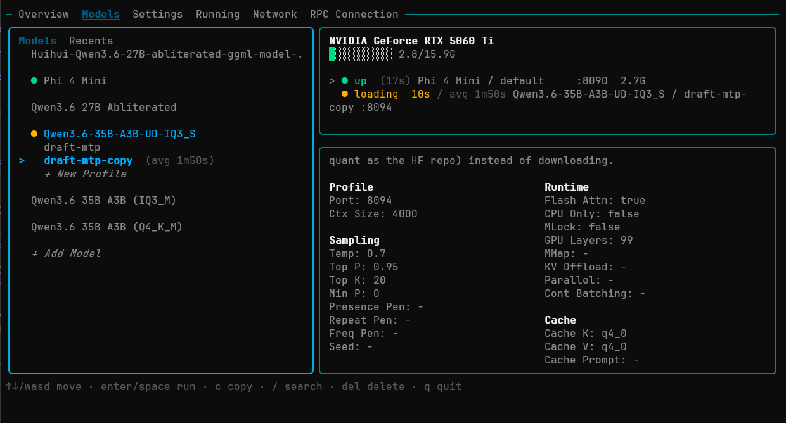
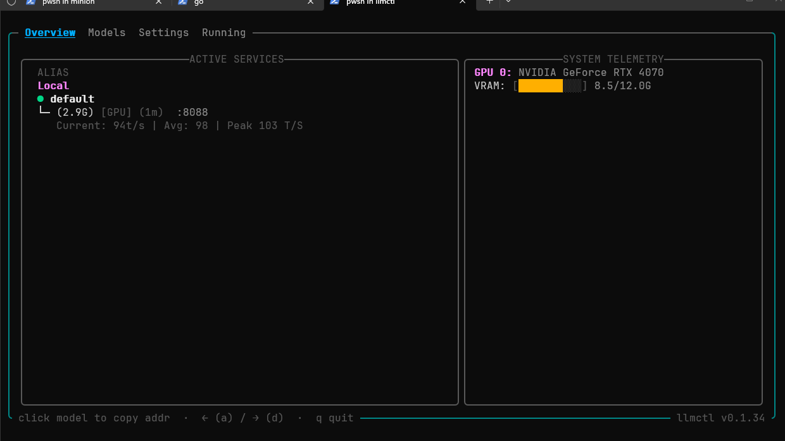
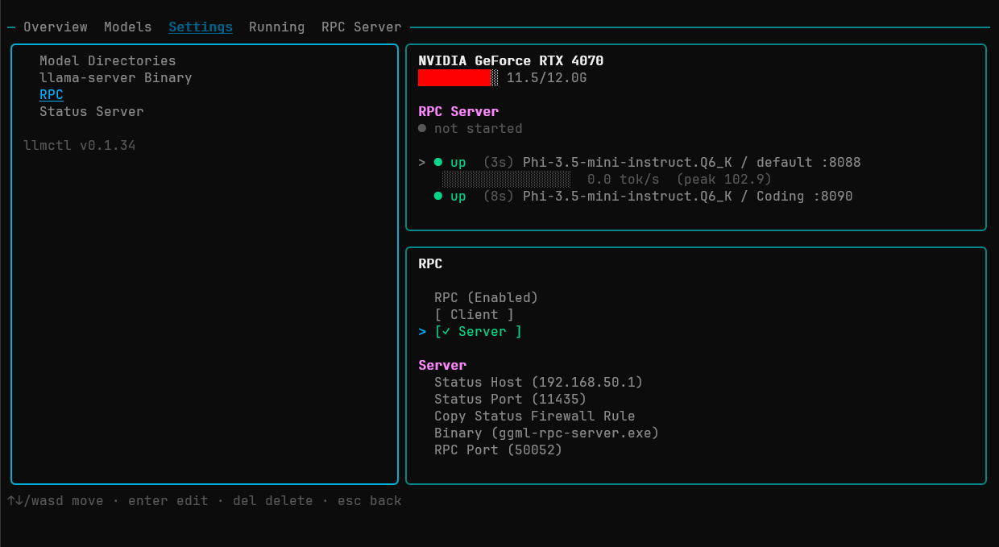
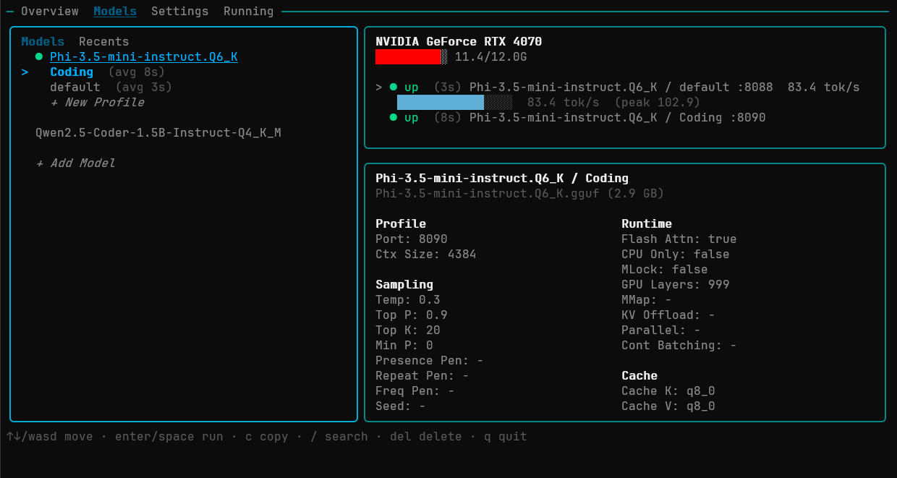
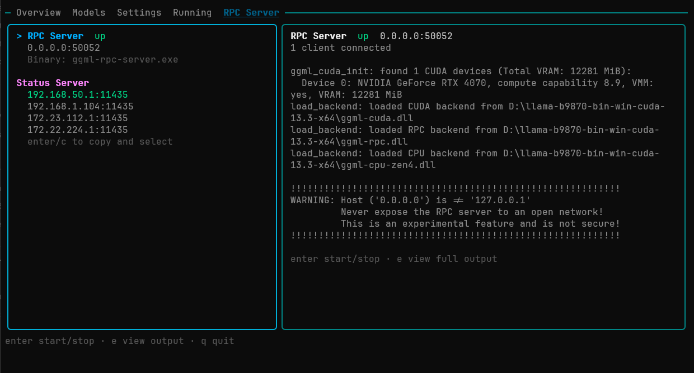

# TUI Reference

Complete keyboard, mouse, and navigation reference for llmctl's terminal interface.

---

## Layout

```
╭─ Overview  Models  Settings  Running  RPC Server ─────────────────────╮
│                          │                                             │
│       Left pane          │           Right pane                        │
│   (tab content)          │   (running instances + details)             │
│                          │                                             │
╰──────────────── click model to copy addr · ← (a) / → (d) · q quit ───╯
```

The TUI has three focus zones that keys act on differently:

| Zone | How to reach |
|---|---|
| **Tab bar** | `←` / `a` from left pane |
| **Left pane** | `↓` from tab bar, or `Enter` |
| **Right pane** | `→` / `d` from left pane when instances are running |

The active zone isn't labelled — the focused pane's border brightens slightly.

---

## Global Keys

These work everywhere on the main screen regardless of which pane is focused.

| Key | Action |
|---|---|
| `q` · `Ctrl+C` | Quit llmctl |
| `e` | Open log viewer for the most recent error |
| `←` · `h` · `a` | Move focus left (toward tab bar) |
| `→` · `l` · `d` | Move focus right (toward running pane) / advance tab |
| `↑` · `k` · `w` | Move cursor up |
| `↓` · `j` · `s` | Move cursor down |
| `Enter` · `Space` | Select / activate current row |
| `Del` | Delete selected item (press twice to confirm) |
| `c` | Copy / duplicate selected profile |
| `e` | View logs for the selected running instance or last error |

Mouse clicks are supported throughout. The active tab, list rows, running instances, and Overview entries all respond to left-click.

---

## Tab Navigation

Navigate between tabs with `←` / `→` (or `a` / `d`) while the tab bar or left pane is focused.

| Tab | Visible when |
|---|---|
| Overview | Always |
| Models | Always |
| Settings | Always |
| Running | Always |
| RPC Server | RPC is enabled in Settings |
| Network | Linux only |

Tabs cycle left-to-right. Overview is the leftmost tab and the default on launch.

---

## Overview Tab

The at-a-glance dashboard. Read-only — no cursor navigation within it.



### Active Services box (left)

Lists every running inference instance on this machine under **Local**, and any running instances on connected RPC client machines under **Remote** (only shown when clients have active models).

Each entry is three lines (or five lines on narrow terminals):

```
  ● Alias
  └─ (size) [GPU|CPU] (uptime)  :port
     Current: 82t/s | Avg: 79 | Peak 94 T/S
```

| Element | Description |
|---|---|
| ● | Health dot: yellow = loading, green = up, red = down |
| Alias | Profile alias if set, otherwise the profile key |
| size | Model file size on disk (e.g. `3.8G`) |
| GPU / CPU | Whether the profile uses GPU layers or CPU-only mode |
| uptime | Time since the instance started |
| :port | The port llama-server is listening on |
| Current | Live tok/s while the model is actively generating |
| Avg | Rolling average tok/s from this session |
| Peak | All-time peak tok/s (persisted across restarts) |

**Click any entry** to copy `host:port` to clipboard. A brief `✓ copied` flash confirms it.

On **narrow terminals** (active services box width below 50 chars), port is hidden and tok/s stats stack vertically:
```
  ● Alias
  └─ (size) [GPU|CPU] (uptime)
     Current: 82t/s
     Avg: 79
     Peak: 94 T/S
```

### System Telemetry box (right)

| Row | Description |
|---|---|
| GPU 0 | Local GPU name (scrolls horizontally if too long) |
| VRAM | Bar + used/total GB for local GPU |
| RAM | Total RAM used by CPU-only model processes (only shown when present) |
| GPU 1 | Remote GPU name (shown in RPC mode when connected) |
| VRAM | Bar + used/total GB for remote GPU |
| RPC BACKEND | Status (ONLINE / OFFLINE / not started), address, client count |

VRAM labels wrap to the next line if the box is too narrow to fit on one line.

---

## Models Tab

Browse, create, and manage models and profiles.



### Sub-tabs

The Models tab has two sub-tabs accessible from the header row inside the left pane:

| Sub-tab | Content |
|---|---|
| **Models** | Full tree of all registered models and their profiles |
| **Recents** | Recently started profiles, in reverse chronological order |

Navigate between sub-tabs with `←` / `→` while the sub-tab header row is focused. Press `↓` or `Enter` to move into the list below.

### Model tree

Models appear as top-level rows. Press `Enter` or `→` to expand a model and reveal its profiles. Press `←` or `Enter` on the model row again to collapse.

```
  Phi-4-mini-instruct Q4
    IDEAutoComplete        :8082  ● up
    FullGPU                :8081  ● loading
  + New Profile
```

Profile rows show their port and health status when running.

### Keys in the Models tree

| Key | Action |
|---|---|
| `Enter` / `→` | Expand model · Enter profile rows · Start/stop a profile |
| `←` | Collapse profile rows back to model level · Back to tab bar |
| `↑` / `↓` | Move through models and profiles |
| `c` | Duplicate the selected profile |
| `Del` | Delete selected profile or model (press twice to confirm) |
| `t` | Open template picker for the selected model (create profile from template) |
| `x` | Open export args screen for the selected profile |
| `/` | Open search / filter (while in Models sub-tab) |

### Starting and stopping

Navigate to a profile row and press `Enter`. A confirmation screen appears showing what will start. Confirm to launch `llama-server` with that profile's settings.

To stop a running instance, navigate to its profile row (marked with a health dot) and press `Enter`. A stop confirmation appears.

### Right pane — Details

When a **model** row is selected: shows the model's source path, file size, and a quick summary of all its profiles.

When a **profile** row is selected: shows the full profile configuration — port, GPU layers, context size, sampling parameters, cache settings, and any extra args.



The details pane auto-scrolls when content is taller than the pane.

---

## Settings Tab

Configure llmctl's runtime environment.



Navigate rows with `↑` / `↓`. Press `Enter` to edit a field. Press `Enter` to save or `Esc` to cancel an edit.

### Model Directories

A list of folders llmctl scans for `.gguf` files. Add as many as needed. Press `Enter` on the **+ Add directory** row to add one. Press `Del` twice on an existing directory to remove it.

### llama-server Binary

Path to the `llama-server` executable. llmctl checks `PATH` first; set this if your binary isn't on `PATH` or you want to pin a specific version.

### RPC Configuration

Shown when RPC is enabled. Fields differ by mode:

**Server mode:**
- RPC server binary path (`ggml-rpc-server`)
- Bind host and port for the RPC server

**Client mode:**
- Remote status server address (`host:port`) — the server machine's status server URL
- RPC endpoint (auto-discovered, or set manually)

### Network Interface (Linux only)

The network interface used for RPC and internet connectivity checks. Shown only on Linux.

---

## Running Tab

Live view of all active instances.



### VRAM bar

At the top of the right pane when a GPU is present. Shows aggregate VRAM usage across all running processes. The amber segment at the start represents the `ggml-rpc-server` (if running); the rest is llama-server processes.

```
████████░░  9.1/12.0G
```

### Instance rows

Each running instance shows:

```
  > ●  up (4m12s)  Phi-Mini :8090   82.3 tok/s   3.8G
       [████████░░░░░░░░░░░░░░] 82 / 94 peak
```

| Element | Description |
|---|---|
| `>` | Cursor indicator |
| ● | Health dot (yellow / green / red) |
| status | `loading` with elapsed/estimated time · `up (load time)` · `down` |
| label | Profile label (model name / profile key) |
| `:port` | Listening port |
| tok/s | Live generation rate (shown only while actively generating) |
| `X.XG` | VRAM used by this process (GPU models) or RAM (CPU-only models) |
| Rate meter | Visual bar showing current rate relative to session peak |

### Actions on a running instance

Press `Enter` on an instance row to open the action menu:

| Action | Description |
|---|---|
| Stop | Gracefully terminate the instance |
| Copy endpoint | Copy `http://localhost:PORT/v1` to clipboard |
| View logs | Open the log viewer for this instance |

---

## RPC Server Tab

Visible only when RPC is enabled in Settings.



### Server mode

Controls for the local `ggml-rpc-server` process:

| Row | Description |
|---|---|
| Status | ONLINE / OFFLINE / loading |
| Address | `host:port` the RPC server is bound to |
| VRAM | GPU memory used by the RPC server process |
| Start / Stop | Press `Enter` to toggle the server |
| LAN addresses | List of local IPs where the status server is reachable |

Press `Enter` on a LAN address row to copy it to clipboard and set it as the configured status server address — share this with client machines.

### Client mode

Shows the connection status to the remote server:

| Row | Description |
|---|---|
| Status | CONNECTED / REACHABLE / polling… / not configured |
| RPC endpoint | The discovered or configured RPC address |
| Server | The remote status server being polled |

---

## Network Tab

Linux only. Controls network interface selection for RPC and internet connectivity.

| Row | Description |
|---|---|
| Internet connection | Currently active interface for internet traffic |
| RPC connection | Interface used for RPC communication |
| Switch to RPC | Switch to the LAN interface (for dedicated GPU networking) |
| Switch to internet | Switch back to internet interface |

Press `Enter` on a Switch row to open an interface picker.

---

## Log Viewer

Opened with `e` from the main screen. Shows the log output of the most recently failed or selected instance.

| Key | Action |
|---|---|
| `↑` / `↓` · `k` / `j` | Scroll |
| `q` · `Esc` | Close and return to main screen |

---

## Modals and Overlays

Several actions open a full-screen overlay instead of changing the main layout.

| Overlay | Triggered by |
|---|---|
| **New profile form** | `+ New Profile` row · template picker selection |
| **Template picker** | `t` on a model row |
| **Start confirmation** | `Enter` on a stopped profile row |
| **Stop confirmation** | `Enter` on a running profile row |
| **Running action menu** | `Enter` on a row in the Running tab |
| **Export args screen** | `x` on a profile row |
| **Log viewer** | `e` key |
| **Model import picker** | `Enter` on `+ Import Model` row |
| **Network switch** | `Enter` on a switch row in the Network tab |

All overlays dismiss with `Esc`.
